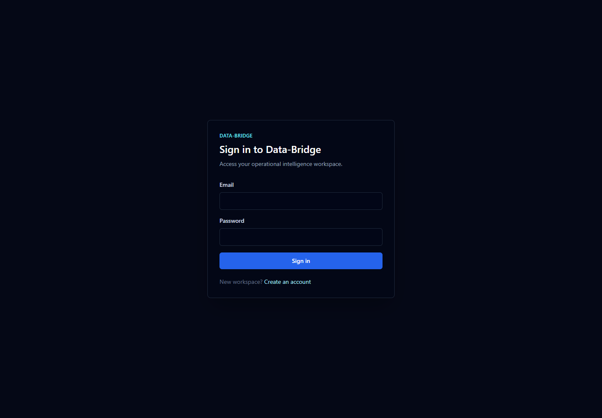
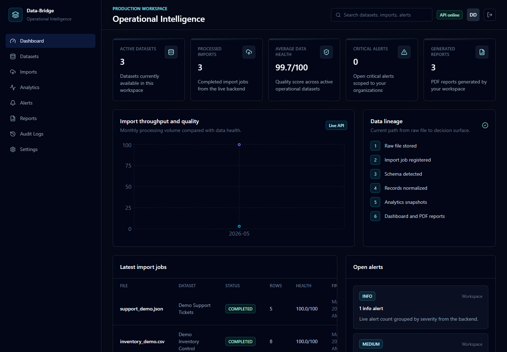
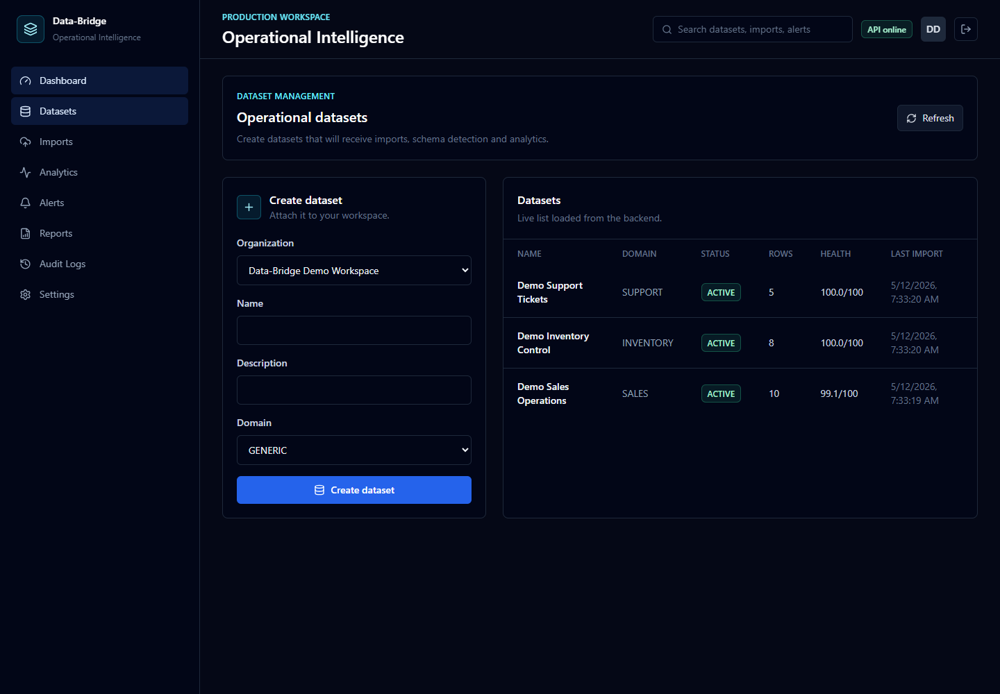
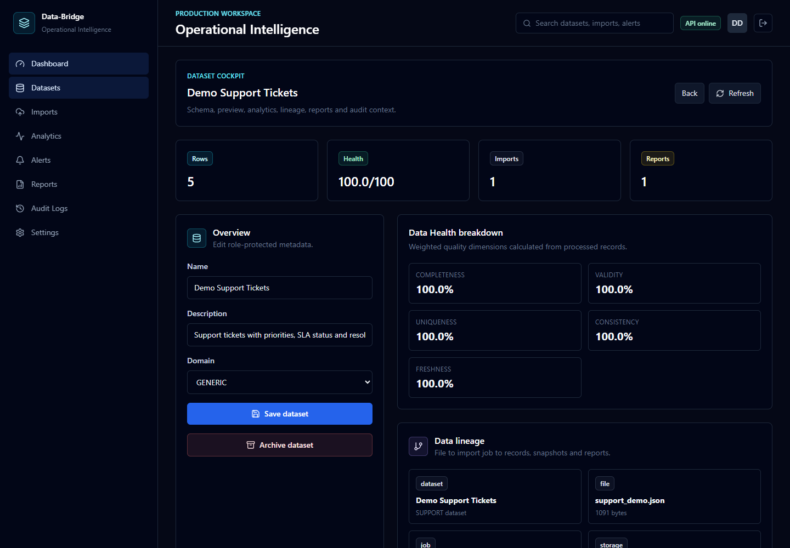
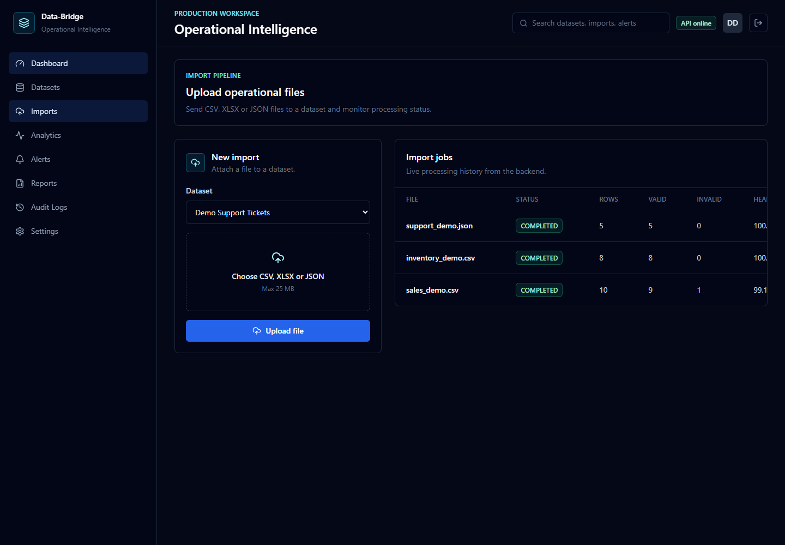
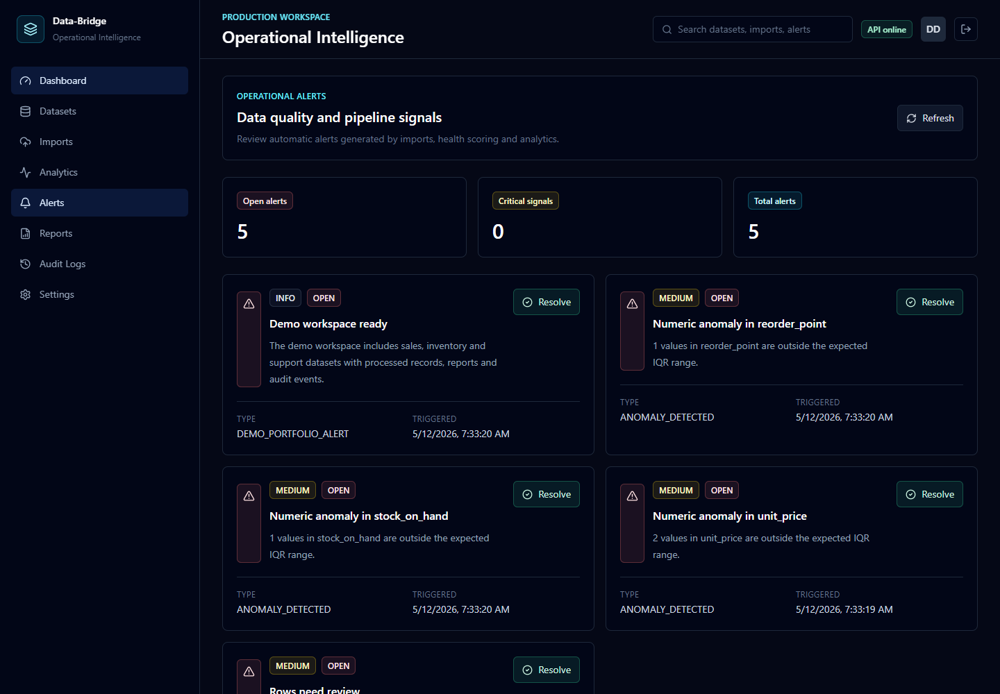
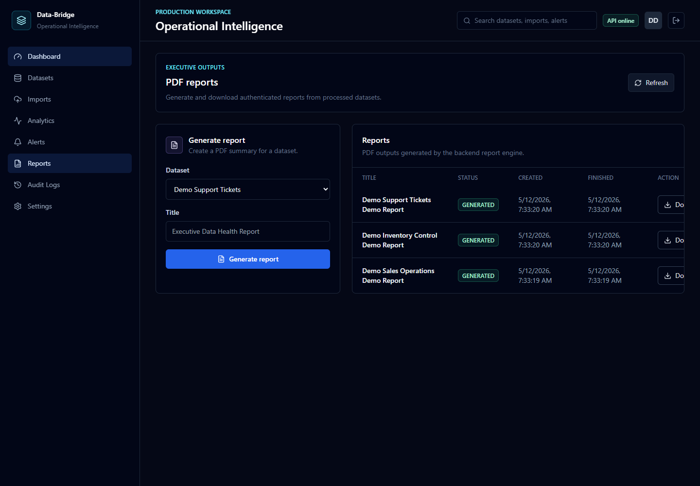
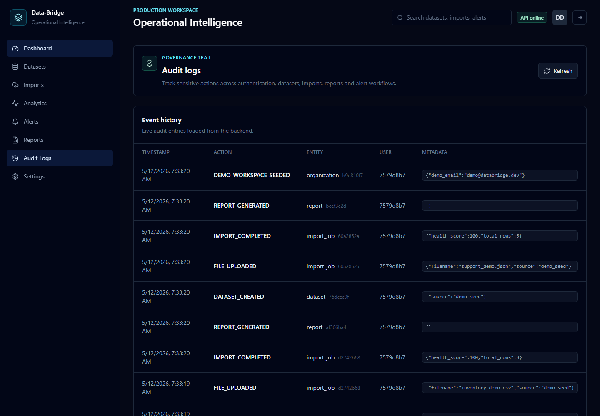
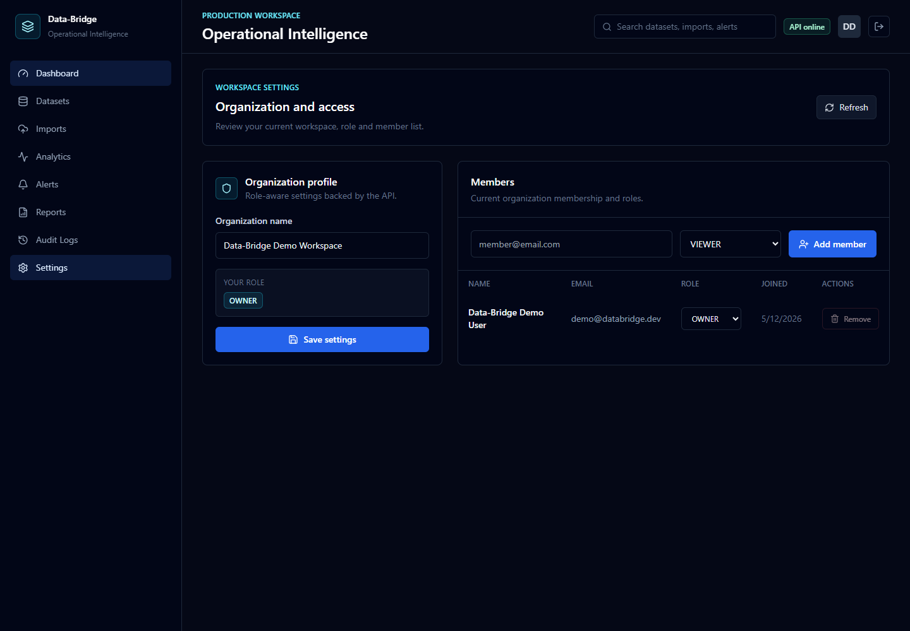

# Data-Bridge


**Data-Bridge** is a Python-first web platform for importing, validating, processing, analyzing and visualizing operational datasets through a production-oriented architecture.

## Portfolio Demo

Data-Bridge is positioned as a portfolio case study for backend Python, full-stack web development, data processing and operational BI.

- Demo credentials: `demo@databridge.dev` / `Demo@123456`
- Demo video: [docs/assets/demo/data-bridge-demo.webm](docs/assets/demo/data-bridge-demo.webm)
- Case study: [docs/product/07_PORTFOLIO_CASE_STUDY.md](docs/product/07_PORTFOLIO_CASE_STUDY.md)
- API docs locally: `http://localhost:8000/docs`
- Frontend locally: `http://localhost:5173`

Cloud deployment is prepared with `render.yaml` for the backend and `frontend/vercel.json` for the Vite frontend. A public live URL should be added after provider credentials and production environment variables are configured.

## Screenshots

| Login | Dashboard |
| --- | --- |
|  |  |

| Datasets | Dataset Cockpit |
| --- | --- |
|  |  |

| Imports | Alerts |
| --- | --- |
|  |  |

| Reports | Audit Logs |
| --- | --- |
|  |  |

| Settings |
| --- |
|  |

## Vision

Data-Bridge transforms raw operational files into trusted intelligence. It connects CSV, XLSX and JSON imports, validation pipelines, asynchronous processing, PostgreSQL persistence, analytical dashboards, PDF-style reports, audit logs and alerting workflows into a single cloud-ready platform.

## What This Proves

- Backend API design with FastAPI, auth, RBAC, uploads and domain modules.
- Data processing with pandas, schema detection, data quality scoring and anomaly alerts.
- Operational BI with dashboards, import monitoring, alerting and PDF reports.
- Governance patterns with organizations, members, audit logs and role-aware UI.
- Delivery discipline with Docker, Alembic, CI, tests, deployment docs and demo assets.

## Core Stack

- Python 3.12
- FastAPI
- PostgreSQL
- SQLAlchemy
- Pandas
- Redis
- Celery
- React
- TypeScript
- Vite
- Docker
- GitHub Actions

## Current Capabilities

- FastAPI backend with OpenAPI docs
- JWT authentication and password hashing
- Organization and dataset management
- File import jobs for CSV, XLSX and JSON
- Pandas-based schema detection and data quality scoring
- Analytics summary and time series endpoints
- Organization-scoped analytics overview endpoint
- Automatic operational alerts
- Statistical anomaly alerts for null rates, duplicates and numeric outliers
- Report registry with generated summary files
- Audit log API
- React login, registration and protected dashboard routes
- Authenticated dataset list and creation UI connected to the API
- Dataset detail cockpit with edit, archive, schema explorer, preview, lineage and health breakdown
- Authenticated upload and import job monitoring UI
- Dashboard metrics connected to the live analytics API
- Authenticated alert management UI with resolve action
- Authenticated reports UI with PDF generation and token-backed download
- Authenticated audit log UI for governance events
- Role-aware frontend actions for datasets, imports, alerts, reports and settings
- Demo seed command with sales, inventory and support datasets
- Docker Compose for PostgreSQL, Redis, API, worker and frontend
- Unified GitHub Actions CI for backend linting, migrations, tests and frontend build
- Frontend tests with Vitest and Testing Library for UI smoke checks and RBAC permissions
- Real screenshot set and automated demo video capture

## Current Status

The repository now contains a functional portfolio MVP: backend, worker, database models, frontend dashboard, documentation, screenshots, demo video and CI workflows are in place. The backend test suite covers health checks, authentication, organizations, upload validation, RBAC, anomaly alerts, dataset detail endpoints, the main import flow, analytics and authenticated PDF report download.

## Architecture

```text
Frontend -> FastAPI API -> PostgreSQL
              |
              v
            Redis
              |
              v
          Celery Worker
              |
              v
       Data Processing Pipeline
```

## Repository Structure

```text
backend/    Python FastAPI application
frontend/   React TypeScript application
docs/       Technical documentation
infra/      Infrastructure and deployment files
.github/    CI/CD workflows and collaboration templates
```

## Running Locally

Create a local environment file:

```bash
cp .env.example .env
```

Start the full stack:

```bash
docker compose up --build
```

Services:

- API: http://localhost:8000
- API docs: http://localhost:8000/docs
- Health check: http://localhost:8000/api/v1/health
- Frontend: http://localhost:5173
- PostgreSQL: localhost:5432
- Redis: localhost:6379

Validate Docker Compose configuration when Docker is available:

```bash
docker compose config
docker compose build
```

Apply database migrations:

```bash
cd backend
alembic upgrade head
```

Load the demo workspace:

```bash
cd backend
python -m app.scripts.seed_demo
```

Demo credentials:

```text
Email: demo@databridge.dev
Password: Demo@123456
```

## Backend Development

```bash
cd backend
python -m venv .venv
.venv\Scripts\Activate.ps1
pip install -e ".[dev]"
alembic upgrade head
pytest
ruff check .
```

## Frontend Development

```bash
cd frontend
npm install
npm run dev
npm run build
```

Frontend environment:

```bash
cp .env.example .env
```

The Vite client reads `VITE_API_BASE_URL`, which should point to the FastAPI `/api/v1` base URL.

## Verification

```bash
cd backend
python -m alembic upgrade head
python -m app.scripts.seed_demo
python -m pytest
python -m ruff check .

cd ../frontend
npm run test -- --run
npm run build
```

## Deployment

Deployment planning is documented in:

- `docs/deployment/DEPLOYMENT.md`
- `docs/deployment/POSTGRESQL_CLOUD.md`
- `docs/deployment/STORAGE.md`

Recommended portfolio topology:

```text
Frontend: Vercel
Backend: Render, Railway or Fly.io
Database: Neon, Supabase, Railway PostgreSQL or Render PostgreSQL
Redis: Upstash, Redis Cloud or Railway Redis
```

Repository deployment helpers:

- Backend Render blueprint: `render.yaml`
- Frontend Vercel config: `frontend/vercel.json`

Production rules:

- `APP_ENV=production`
- `APP_DEBUG=false`
- `AUTO_CREATE_TABLES=false`
- Run `alembic upgrade head`
- Restrict `CORS_ORIGINS` to the frontend domain
- Keep secrets out of Git

## Product Modules

- Authentication
- Organizations
- Datasets
- Imports
- Processing
- Analytics
- Alerts
- Reports
- Audit logs

## Database Migrations

Alembic is the authoritative schema path for PostgreSQL. The backend still supports `AUTO_CREATE_TABLES=true` for fast local bootstrapping, but portfolio and production workflows should use:

```bash
cd backend
alembic upgrade head
```

Migration validation used for this baseline:

```bash
alembic upgrade head
alembic downgrade -1
alembic upgrade head
```

## Roadmap

- Publish backend and frontend to public cloud URLs.
- Connect a managed PostgreSQL database and run production migrations.
- Configure managed Redis or document eager Celery mode for the public demo.
- Add the final public demo link to this README.

## License

MIT License.
